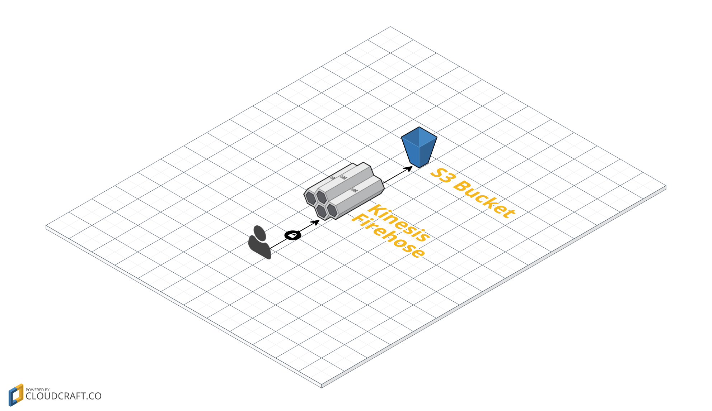
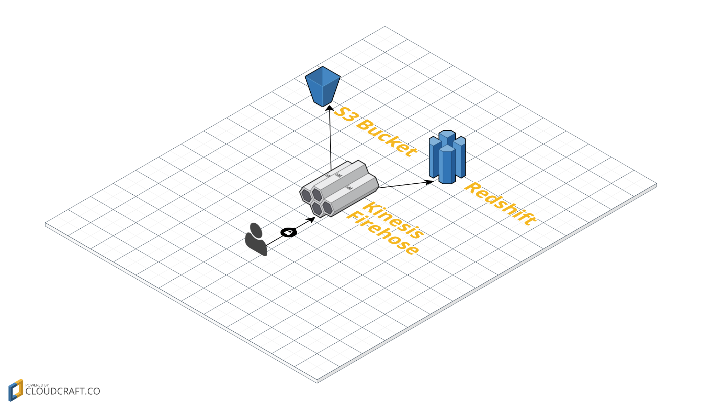

# byo-data-pipeline

This repo contains a set of terraform configuration for crating your own totally managed data pipelines on top of AWS.

## Getting started

If you haven't already, you'll need to install Terraform and download AWS
user keys.

Install Terraform (from OSX) via brew

```bash
$ brew install terraform
```

or via the [downloads page][download-terraform].

Next, you'll want to get AWS keys and export them as [environment variables
or add them to your `~/.aws/config`][aws-setup].


[download-terraform]: https://www.terraform.io/downloads.html
[aws-setup]: http://docs.aws.amazon.com/cli/latest/userguide/cli-chap-getting-set-up.html

## V1: Firehose to S3



As a first step, we'll put our firehose data in S3. If you're doing nothing
else, you'll want a raw log of the data at the minimum.

We can build this incredibly easily by creating a Kinesis Firehose that sends
to S3.

Files are uploaded by date and streamed directly as concatenated JSON objects:

```bash
s3://<bucket>/yyyy/mm/dd/<uuid>
```

## V2: Firehose to Redshift



But what if we'd like to do more ad-hoc analysis? We can create a pipeline to
send data from our Firehose directly into Redshift.

If you already built the earlier pipeline, we'll tear it down to manage our
new state:

```bash
$ make clean BUCKET=<your-bucket-name>
$ make destroy-firehose-to-s3
```

This step is a little more complicated, as it involves setting up our own IAM
permissions and VPC so that our pipeline can talk to an internal Redshift
instance we've setup. We'll need to configure all of this, but once it is setup we don't need to do any maintenance for the data.

First we'll want to provision our infrastructure:

```bash
$ make firehose-to-redshift
```

Once that's done, it should have created a redshift instance for us. From there
we'll want to set up the appropriate data in our redshift cluster

```bash
$ psql --host=<host> --username=<user> --port=5439 --dbname=firehose

firehose=# create table events (
  user_id varchar(128),
  event varchar(128),
  company varchar(128)
);

```

I've created a sample schema here, but you can imagine that this could follow
any schema you want to design. However you want to structure your data, we'll
have to specifically create it inside of Redshift before sending it to Kineis.

## Sending data

It's not too much fun to build data pipelines without any data to analyze!

We can start by sending some random data:

```shell
$ go get -u ./...
$ go run main.go \
  --stream <events>
  --count <10000>
  --rate <100>
```

## License

MIT
